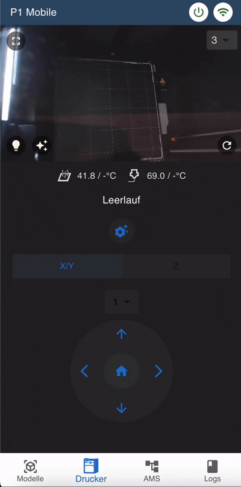

# 🖨️ P1 Mobile – Local Web App for Bambu Lab P1S

<table border="0">
  <tr style="vertical-align: top; border: none;">
    <td>
      
    </td>
    <td>
      **P1 Mobile** is a local-first web application for managing your Bambu Lab P1S 3D printer – fully independent from the cloud.  
      It is built using a Node.js (TypeScript) backend and a React frontend and communicates solely via local printer APIs (mqtt, ftp, http).
    </td>
  </tr>
</table>

## 💡 Motivation
While Bambu Lab printers are technically impressive and deliver outstanding print quality, their ecosystem is increasingly tied to cloud services.  
Unfortunately, this trend limits local control, offline usability, and integration into private or self-hosted environments.


## 🔧 Features

- 🌐 **100% local** – No cloud, no account, no internet dependency  
- 📁 **Manage and start prints directly** from the web UI  
- 📸 **Live video stream integration** directly from the printer  
- 📤 **Native FTP server support** for file uploads  
- 🎥 **Native Live Video** for Stream & Status
- 🧠 **Optional MQTT proxy** to your smart home system  
- 💡 **Direct control of external devices** (e.g. via Tasmota Switch)
- 🖼️ **Model thumbnails** for easy recognition  

## ✅ Tested Firmware Versions

The following Bambu Lab firmware versions have been verified for compatibility:

| Firmware Version | Status     |
|------------------|------------|
| `01.07.xx.xx`    | Tested     |
| `01.08.xx.xx`    | Tested     |
| `01.09.00.00`    | Tested     |

- Compatibility with future firmware releases is expected, but will be tested incrementally.

## 📷 Preview
<p align="center">
  
  
  
  
  
</p>
<p align="center">
  
</p>

## Requirements

To run **P1 Mobile** locally, you'll need:

- A **Bambu Lab P1S** printer with **Local Mode enabled** (for firmware **01.08.00.00 or higher, Developer Mode must also be enabled!**)
- **Docker** and **Docker Compose** installed on the machine where you want to run the app (e.g. your homelab or local server)
- Your **P1S must be powered on** and **connected to the same network** as the machine running the app at startup
## 🐳 Docker Compose Setup

P1 Mobile is fully containerized and can be started with Docker Compose.

### `docker-compose.yml`
```yaml

services:
  p1-mobile:
    image: ghcr.io/rico001/p1-mobile:main-latest
    container_name: p1-mobile
    ports:
      - "3003:3000" #CHANGE to your desired port(s)
    environment:
      # required environment variables:
      - SERVER_PORT=3000 # CHANGE to your desired port, if you want 
      - PRINTER_SERIAL_NUMBER=12345 #!! CHANGE to your printer serial number
      - PRINTER_IP=192.168.178.79 #!! CHANGE to your printer IP
      - PRINTER_ACCESS_CODE=88223979 #!! CHANGE to your printer access code
      - PRINTER_VIDEO_PORT=6000 # should be allways 6000 for p1s
      - PRINTER_MQTT_PORT=8883 # should be allways 8883 for p1s
      - PRINTER_FTP_PORT=990 # should be allways 990 for p1s
      - PRINTER_USER=bblp # should be allways bblp for p1s
      - PRINTER_CA_CERT_PATH=cert/blcert.pem # currently only internal cert/blcert.pem is supported, do not change this

      # -------- optional environment variables --------
      - EXTERN_VIDEO_STREAM_1=http://192.168.178.52:8080/?action=stream # to set an external video, see section below for more details
      - EXTERN_VIDEO_STREAM_2=http://192.168.178.52:8081/?action=stream # to set an external video, see sectio below for more details
      - PRINTER_ERRORS_WHITELIST=0500-C011 #to ignore specific errors in frontend, e.g. 0500-C011 (https://wiki.bambulab.com/en/hms/error-code)
      - THIRD_PARTY_IFRAME_TOGGLE_SRC=http://portainer-my-apps.fritz.box:5000/?deviceId=6827c4887ea5ad00133d18d6 #to set a icon in printersteam, for external lamp or other devices
      - TASMOTA_SWITCH_IP=192.168.178.100 # to set an icon-button for external tasmota power switch
      # optional, if you want send messages to a another MQTT broker for home automation or other purposes
      - PROXY_MQTT_BROKER_IP=192.168.178.173
      - PROXY_MQTT_BROKER_PORT=1883
      - PROXY_MQTT_BROKER_USER= 
      - PROXY_MQTT_BROKER_PASSWORD=
      - PROXY_MQTT_BROKER_TOPIC_PREFIX=bambu-p1s
      - PROXY_MQTT_BROKER_ENABLED=true
    restart: unless-stopped
    volumes:
      - ./thumbnails:/app/thumbnails
```

## 🎥 (Optional) External Video Stream

If you want to use an external video stream (e.g., from a Raspberry Pi with an old webcam or similar), you can set it up as follows:

### 1. Connect a Camera to the Raspberry Pi

After connecting a camera to your Raspberry Pi, you can use the following Docker Compose configuration to run MJPEG Streamer:

### 2. Install MJPEG Streamer on Raspberry Pi
### `docker-compose.yml`
```yaml

  mjpg-streamer-0:
    image: ghcr.io/rico001/external-videostream:main-latest
    container_name: mjpg-streamer-0
    devices:
      - "/dev/v4l/by-id/<CAM_ID>:/dev/cam-0" # Replace <CAM_ID> with your camera's ID from /dev/v4l/by-id
    environment:
      CAMERA_DEV: /dev/cam-0
      MJPEG_STREAMER_INPUT: "-y -r 1920x1080" # Change resolution as needed
    security_opt:
      - no-new-privileges:true
    ports:
      - "8080:8080"
    restart: unless-stopped

  mjpg-streamer-1:
    image: ghcr.io/rico001/external-videostream:main-latest
    container_name: mjpg-streamer-1

    devices:
      - "/dev/v4l/by-id/<CAM_ID>:/dev/cam-1"
    environment:
      CAMERA_DEV: /dev/cam-1
      MJPEG_STREAMER_INPUT: "-n -r 1920x1080 -f mjpeg"
    security_opt:
      - no-new-privileges:true
    ports:
      - "8081:8080"
    restart: unless-stopped
  
```

## 🔒 Security Notice

> ⚠️ **Important:**  
> This app **does not include user authentication** or **built-in SSL/TLS encryption**.

For your safety, **do not expose this service directly to the internet.**  
Instead, consider one of the following secure deployment methods:

### ✅ Recommended Secure Alternatives

- 🛡️ **VPN Access (Recommended)**  
  Use VPN-based remote access to your local network, such as:
  - **WireGuard**
  - **OpenVPN**
  - **Tailscale**

## Planned Features
- **AMS Management** – Manage AMS units directly from the app
- **Localization** – Support for multiple languages
- **User Authentication** – Add user management and authentication
- **Multi-Printer Support** – Manage multiple printers from one interface
- **Realtime Gcode Viewer** – View G-code files in real-time for current prints
- **Print History** – Track and manage print history

## 🙏 Thanks
Special thanks to [Doridian/OpenBambuAPI](https://github.com/Doridian/OpenBambuAPI)  
for the reverse-engineering work and documentation of the local Bambu Lab API,  
which greatly facilitated the implementation of this project.
